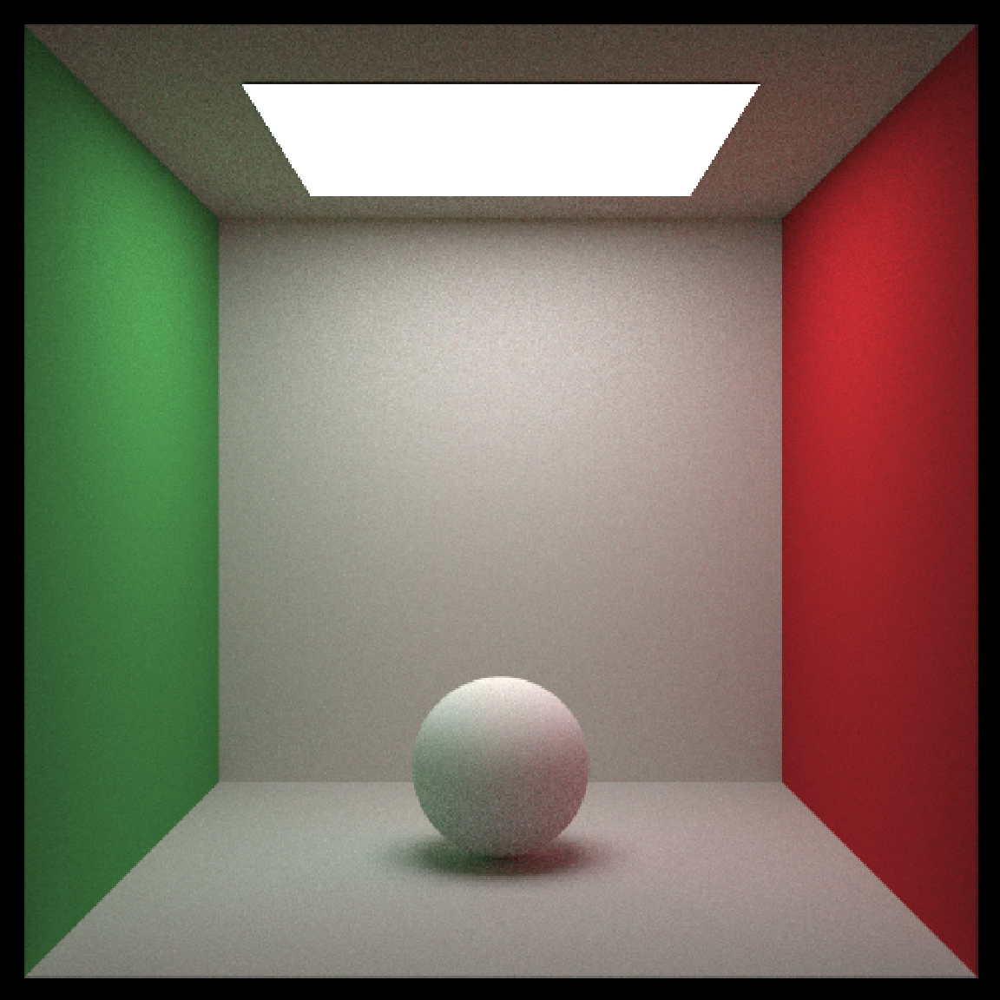
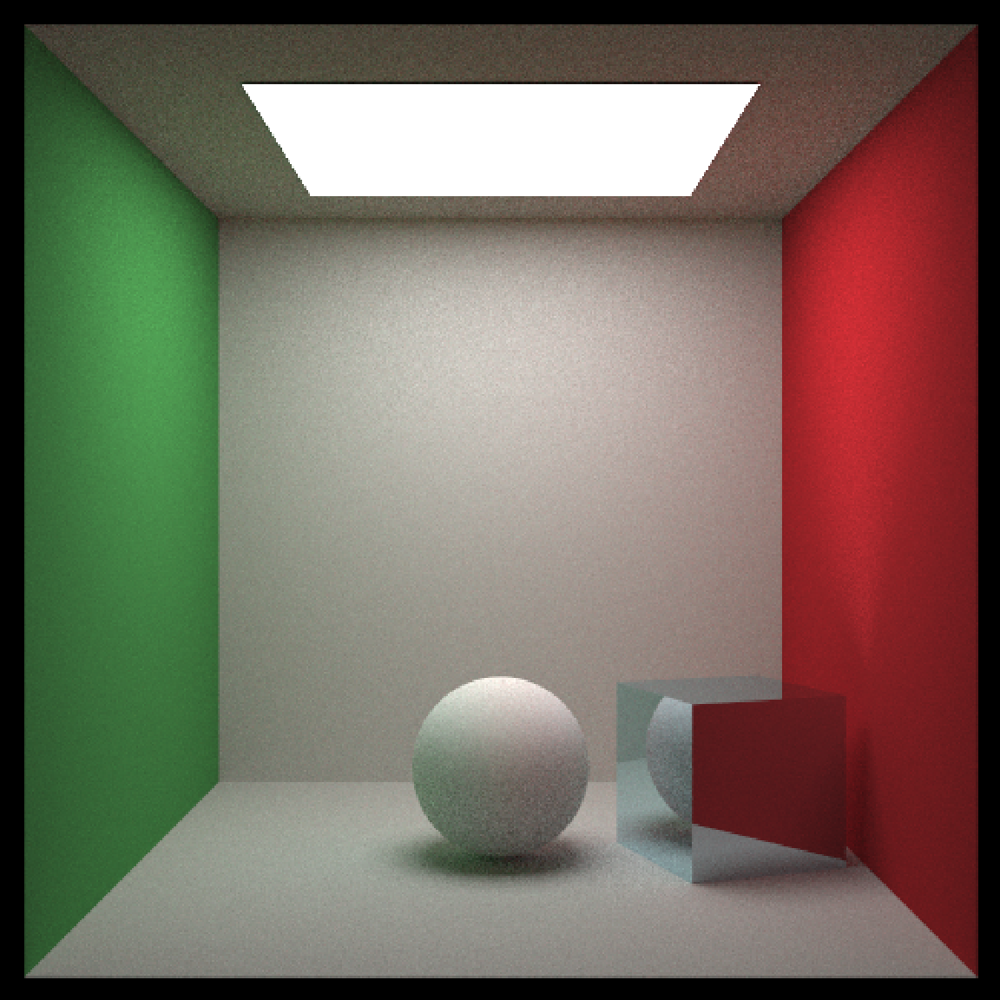
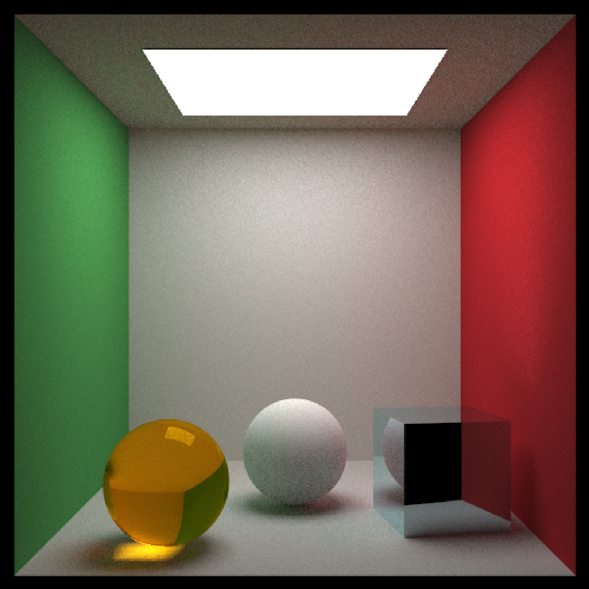
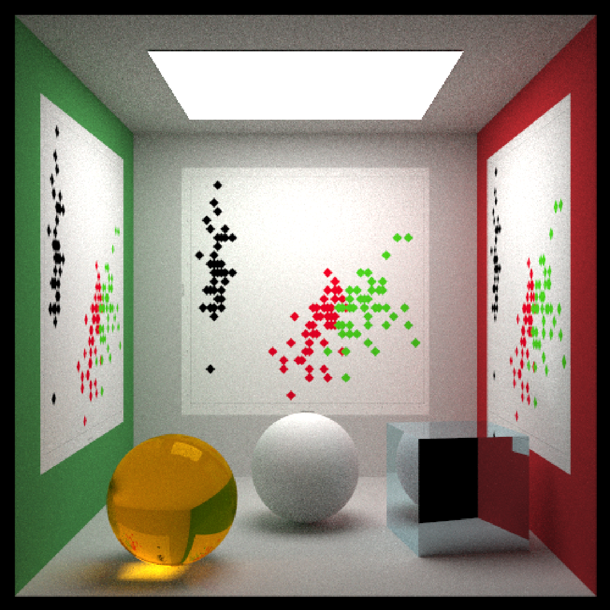

# rayrender

</img>

## Overview

**rayrender** is an open source R package for raytracing scenes in
created in R. Based off of Peter Shirley’s three books “Ray Tracing in
One Weekend”, “Ray Tracing: The Next Week”, and “Ray Tracing: The Rest
of Your Life”, this package provides a tidy R API to a raytracer built
in C++ to render scenes out of spheres, planes, and cubes. **rayrender**
builds scenes using a pipeable iterative interface, and supports
Lambertian (diffuse), metallic, and dielectric (glass) materials,
lights, as well as procedural and user-specified image textures.
**rayrender** includes multicore support via RcppParallel and random
number generation via the PCG RNG.

Browse the documentation and see more examples at the website:

www.rayrender.net

## Installation

``` r
# To install the latest version from Github:
# install.packages("devtools")
devtools::install_github("tylermorganwall/rayrender")
```

## Usage

``` r
library(rayrender)

#Start by generating the Cornell box
scene = generate_cornell()
render_scene(scene, lookfrom=c(278,278,-800),lookat = c(278,278,0), aperture=0, fov=40, samples = 500,
             ambient_light=FALSE, parallel=TRUE, width=500, height=500, clamp_value = 5)
```

<!-- -->

``` r
#Add a sphere to the center of the box, utilizing the pipe to compose the scene
generate_cornell() %>%
  add_object(sphere(x=555/2,y=555/8,z=555/2,radius=555/8)) %>%
  render_scene(lookfrom=c(278,278,-800),lookat = c(278,278,0), aperture=0, fov=40,  samples = 500,
             ambient_light=FALSE, parallel=TRUE, width=500, height=500, clamp_value = 5)
```

<!-- -->

``` r
#Add a metal cube to the scene
generate_cornell() %>%
  add_object(sphere(x=555/2,y=555/8,z=555/2,radius=555/8)) %>%
  add_object(cube(x=100,y=130/2,z=555/2,xwidth = 130,ywidth=130,zwidth = 130,
                  material=metal(color="lightblue"),angle=c(0,20,0))) %>%
  render_scene(lookfrom=c(278,278,-800),lookat = c(278,278,0), aperture=0, fov=40,  samples = 500,
             ambient_light=FALSE, parallel=TRUE, width=500, height=500, clamp_value = 5)
```

<!-- -->

``` r
#Add a colored glass sphere, now saving the scene and passing that to render_scene
scene = generate_cornell() %>%
  add_object(sphere(x=555/2,y=555/8,z=555/2,radius=555/8)) %>%
  add_object(cube(x=100,y=130/2,z=200,xwidth = 130,ywidth=130,zwidth = 130,
                  material=metal(color="lightblue"),angle=c(0,10,0))) %>%
  add_object(sphere(x=420,y=555/8,z=100,radius=555/8,
                    material = dielectric(color="orange"))) 
render_scene(scene, lookfrom=c(278,278,-800),lookat = c(278,278,0), aperture=0, fov=40,  samples = 500,
             ambient_light=FALSE, parallel=TRUE, width=500, height=500, clamp_value = 5)
```

<!-- -->

``` r
#Plaster the walls with the iris dataset using textures applied to rectangles
tempfileplot = tempfile()
png(filename=tempfileplot,height=1600,width=1600)
plot(iris$Petal.Length,iris$Sepal.Width,col=iris$Species,pch=18,cex=12)
dev.off()
```

    ## quartz_off_screen 
    ##                 2

``` r
image_array = png::readPNG(tempfileplot)

scene %>%
  add_object(yz_rect(x=0.01,y=300,z=555/2,zwidth=400,ywidth=400,
                     material = lambertian(image = image_array))) %>%
  add_object(yz_rect(x=555/2,y=300,z=555-0.01,zwidth=400,ywidth=400,
                     material = lambertian(image = image_array),angle=c(0,90,0))) %>%
  add_object(yz_rect(x=555-0.01,y=300,z=555/2,zwidth=400,ywidth=400,
                     material = lambertian(image = image_array),angle=c(0,180,0))) %>%
  render_scene(lookfrom=c(278,278,-800),lookat = c(278,278,0), aperture=0, fov=40,  samples = 500,
             ambient_light=FALSE, parallel=TRUE, width=500, height=500, clamp_value = 5)
```

<!-- -->
