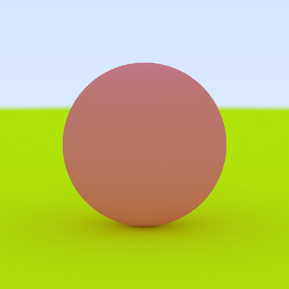
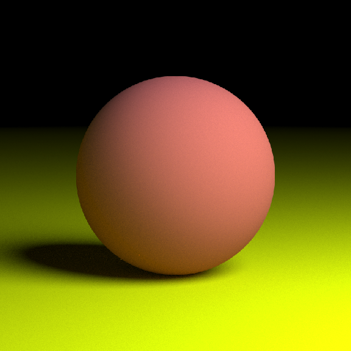
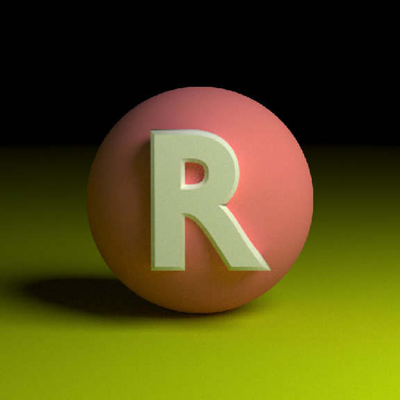
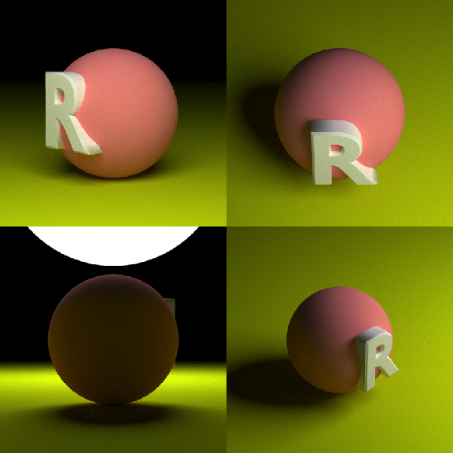
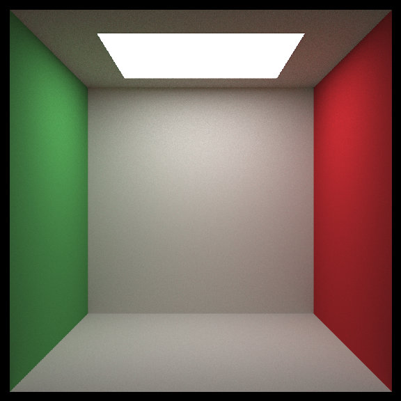
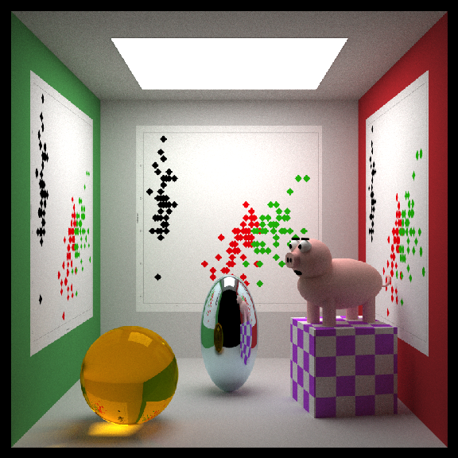
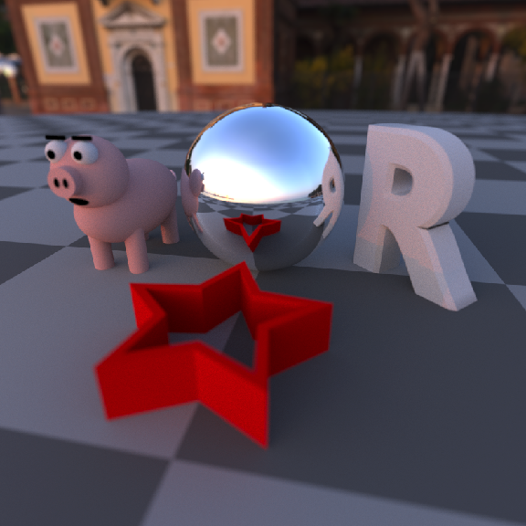

# rayrender

</img>

## Overview

**rayrender** is an open source R package for raytracing scenes in
created in R. Based off of Peter Shirley’s three books “Ray Tracing in
One Weekend”, “Ray Tracing: The Next Week”, and “Ray Tracing: The Rest
of Your Life”, this package provides a tidy R API to a raytracer built
in C++ to render scenes built out of an array of primitives.
**rayrender** builds scenes using a pipeable iterative interface, and
supports diffuse, metallic, dielectric (glass), light emitting
materials, as well as procedural and user-specified image textures and
HDR environment lighting. **rayrender** includes multicore support (with
progress bars) via RcppThread, random number generation via the PCG RNG,
and `.obj` file support via TinyObjLoader.

Browse the documentation and see more examples at the website (if you
aren’t already there):

<a href="https://www.rayrender.net">rayrender.net</a>

</img>

## Installation

``` r
# To install the latest version from Github:
# install.packages("devtools")
devtools::install_github("tylermorganwall/rayrender")
```

## Usage

We’ll first start by rendering a simple scene consisting of the ground,
a sphere, and the included `R.obj` file. The location of the `R.obj`
file can be accessed by calling the function `r_obj()`. First adding the
ground using the `render_ground()` function. This renders an extremely
large sphere that (at our scene’s scale) functions as a flat surface. We
also add a simple red sphere to the scene.

``` r
library(rayrender)

scene = generate_ground() %>%
  add_object(sphere(material = diffuse(color="#ff5555")))
render_scene(scene, parallel = TRUE, width = 800, height = 800, samples = 1000)
```

<!-- -->

By default, a scene without any lights includes a blue sky. We can turn
this off either by setting `ambient_light = FALSE`, or by adding a light
to our scene. We will add an emissive sphere above and behind our
camera.

``` r
scene = generate_ground() %>%
  add_object(sphere(material = diffuse(color="#ff5555", sigma=100))) %>%
  add_object(sphere(y=5, z = 5, x = 5, radius = 3, 
                    material = light(intensity = 10))) 
render_scene(scene, parallel = TRUE, width = 800, height = 800, samples = 1000)
```

<!-- -->

Now we’ll add the (included) R .obj file into the scene, using the
`obj_model()` function. We will scale it down slightly using the
`scale_obj` argument, and then embed it on the surface of the ball.
We’ll also turn down the light intensity.

``` r
scene = generate_ground() %>%
  add_object(sphere(material = diffuse(color="#ff5555"))) %>%
  add_object(obj_model(r_obj(), y = -0.4, z = 0.9, scale_obj = 0.6)) %>%
  add_object(sphere(y=5, z = 5, x = 5, radius = 3, 
                    material = light(intensity = 5))) 
render_scene(scene, parallel = TRUE, width = 800, height = 800, samples = 1000)
```

<!-- -->

Here we’ll render a grid of different viewpoints.

``` r
par(mfrow=c(2,2))
render_scene(scene, parallel = TRUE, width = 400, height = 400, lookfrom = c(7,1,7), samples = 1000)
render_scene(scene, parallel = TRUE, width = 400, height = 400, lookfrom = c(0,7,7), samples = 1000)
render_scene(scene, parallel = TRUE, width = 400, height = 400, lookfrom = c(-7,0,-7), samples = 1000)
render_scene(scene, parallel = TRUE, width = 400, height = 400, lookfrom = c(-7,7,7), samples = 1000)
```

<!-- -->

``` r
par(mfrow=c(1,1))
```

Here’s another example: We start by generating an empty Cornell box and
rendering it with `render_scene()`. Setting `parallel = TRUE` will
utilize all available cores on your machine. The `lookat`, `lookfrom`,
`aperture`, and `fov` arguments control the camera, and the `samples`
argument controls how many samples to take at each pixel. Higher sample
counts result in a less noisy image.

``` r
scene = generate_cornell()
render_scene(scene, lookfrom=c(278,278,-800),lookat = c(278,278,0), aperture=0, fov=40, samples = 1000,
             ambient_light=FALSE, parallel=TRUE, width=800, height=800, clamp_value = 5)
```

<!-- -->

Here we add a metal ellipsoid, a checkered purple cube, a colored glass
sphere, a pig, and plaster the walls with the iris dataset using
textures applied to rectangles. We first write the textures out to a
temporary filename, and then read the image back in using the
`png::readPNG()` function. We then pass this to the `image` argument in
the diffuse material, which applies it as a texture.

``` r
tempfileplot = tempfile()
png(filename=tempfileplot,height=1600,width=1600)
plot(iris$Petal.Length,iris$Sepal.Width,col=iris$Species,pch=18,cex=12)
dev.off()
```

    ## quartz_off_screen 
    ##                 2

``` r
image_array = png::readPNG(tempfileplot)

generate_cornell() %>%
  add_object(ellipsoid(x=555/2,y=100,z=555/2,a=50,b=100,c=50, material = metal(color="lightblue"))) %>%
  add_object(cube(x=100,y=130/2,z=200,xwidth = 130,ywidth=130,zwidth = 130,
                  material=diffuse(checkercolor="purple", checkerperiod = 30),angle=c(0,10,0))) %>%
  add_object(pig(x=100,y=190,z=200,scale=40,angle=c(0,30,0))) %>%
  add_object(sphere(x=420,y=555/8,z=100,radius=555/8,
                    material = dielectric(color="orange"))) %>%
  add_object(yz_rect(x=0.01,y=300,z=555/2,zwidth=400,ywidth=400,
                     material = diffuse(image = image_array))) %>%
  add_object(yz_rect(x=555/2,y=300,z=555-0.01,zwidth=400,ywidth=400,
                     material = diffuse(image = image_array),angle=c(0,90,0))) %>%
  add_object(yz_rect(x=555-0.01,y=300,z=555/2,zwidth=400,ywidth=400,
                     material = diffuse(image = image_array),angle=c(0,180,0))) %>%
  render_scene(lookfrom=c(278,278,-800),lookat = c(278,278,0), aperture=0, fov=40,  samples = 1000,
             ambient_light=FALSE, parallel=TRUE, width=800, height=800, clamp_value = 5)
```

<!-- -->

Finally, rayrender supports environment lighting with the
`environment_light` argument. Pass a high dynamic range image (`.hdr`)
or a low-dynamic range image (`.jpg`,`.png`) and the image will be used
to light the scene (along with any other lights). Here’s an example
using an HDR image of Venice at sunset (obtained for free from
hdrihaven.com), also using the Oren-Nayar diffuse model with `sigma
= 90` for a more realistic diffuse surface. We also add an extruded
polygon star, using the `extruded_polygon` object.

``` r
tempfilehdr = tempfile(fileext = ".hdr")
download.file("https://www.tylermw.com/data/venice_sunset_2k.hdr",tempfilehdr)

#Create star polygon
angles = seq(0,360,by=36)
xx = rev(c(rep(c(1,0.5),5),1) * sinpi(angles/180))
yy = rev(c(rep(c(1,0.5),5),1) * cospi(angles/180))
star_polygon = data.frame(x=xx,y=yy)
hollow_star = rbind(star_polygon,0.8*star_polygon)

generate_ground(material = diffuse(color="grey20", checkercolor = "grey50",sigma=90)) %>%
  add_object(sphere(material=metal())) %>%
  add_object(obj_model(y=-1,x=-1.8,r_obj(), angle=c(0,135,0),material = diffuse(sigma=90))) %>%
  add_object(pig(x=1.8,y=-1.2,scale=0.5,angle=c(0,90,0),diffuse_sigma = 90)) %>%
  add_object(extruded_polygon(hollow_star,top=-0.5,bottom=-1, z=-2,
                              hole = nrow(star_polygon),
                              material=diffuse(color="red",sigma=90))) %>%
  render_scene(parallel = TRUE, environment_light = tempfilehdr, width=800,height=800,
               fov=70,clamp_value=10,samples=1000, aperture=0.1,
               lookfrom=c(-0.9,1.2,-4.5),lookat=c(0,-1,0))
```

<!-- -->
